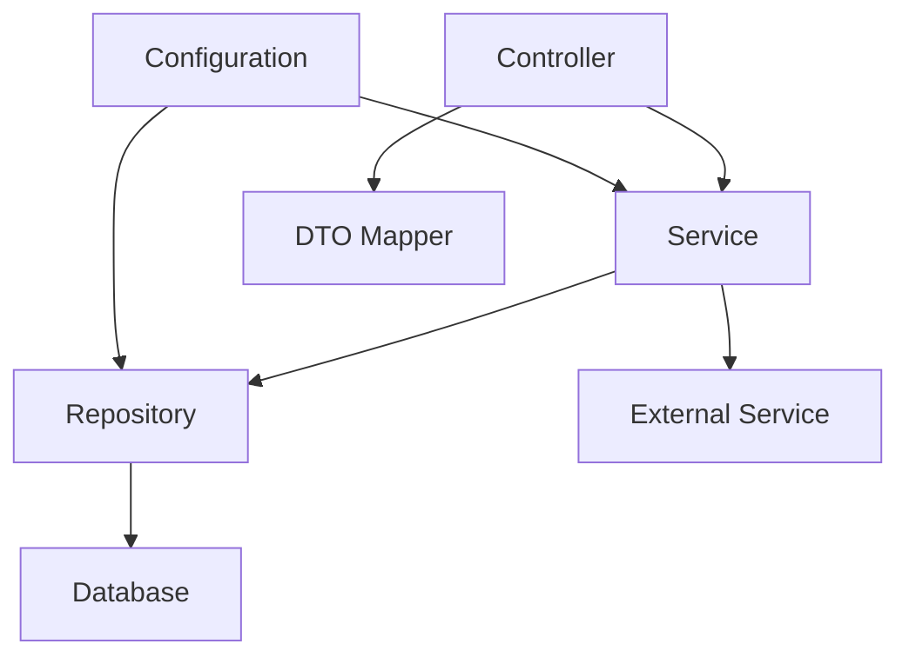

# Analysis Methodology

## Systematic Project Analysis Framework

### Phase 1: Project Discovery (15-20 minutes)

#### 1.1 Build System Analysis

```bash
# Maven project indicators
- pom.xml in root directory
- Multi-module: multiple pom.xml files
- Parent-child relationships in POMs
- Dependency management sections

# Gradle project indicators
- build.gradle or build.gradle.kts
- settings.gradle for multi-project
- gradle.properties for configuration
- Gradle wrapper (gradlew)
```

#### 1.2 Project Structure Mapping

```
Quick Assessment Checklist:
□ Single module vs multi-module structure
□ Source directory layout (src/main/java, src/test/java)
□ Resources organization (application.yml, static, templates)
□ Package hierarchy depth and organization
□ Configuration file locations and types
```

#### 1.3 Technology Stack Identification

```java
// Primary framework detection
@SpringBootApplication  // Spring Boot
@Configuration         // Spring Framework
@Entity               // JPA/Hibernate
@Mapper               // MyBatis
@RestController       // Spring Web MVC
```

### Phase 2: Architecture Analysis (20-25 minutes)

#### 2.1 Layer Identification

```
Presentation Layer:
- Controllers (@Controller, @RestController)
- Request/Response DTOs
- Exception handlers (@ControllerAdvice)
- Web configuration

Business Layer:
- Services (@Service)
- Business logic implementations
- Domain models/entities
- Validation logic

Persistence Layer:
- Repositories (@Repository)
- Data access objects (DAOs)
- Entity mappings
- Database configurations

Infrastructure Layer:
- Configuration classes (@Configuration)
- Utility classes
- Cross-cutting concerns (logging, caching)
- External service integrations
```

#### 2.2 Dependency Flow Analysis



#### 2.3 Design Pattern Recognition

```java
// Repository Pattern
public interface UserRepository extends JpaRepository<User, Long> {
    List<User> findByActiveTrue();
}

// Factory Pattern
@Component
public class NotificationFactory {
    public Notification createNotification(NotificationType type) {
        // Factory implementation
    }
}

// Strategy Pattern
public interface PaymentStrategy {
    PaymentResult process(PaymentRequest request);
}

// Builder Pattern
public class User {
    public static UserBuilder builder() {
        return new UserBuilder();
    }
}
```

### Phase 3: Code Convention Analysis (15-20 minutes)

#### 3.1 Naming Convention Audit

```java
// Package naming patterns
com.company.project.domain.user     // Domain-based
com.company.project.controller      // Layer-based
com.company.project.user.controller // Feature-based

// Class naming analysis
UserController vs UserRestController vs UserApiController
UserService vs UserServiceImpl vs IUserService
UserRepository vs UserDAO vs UserMapper

// Method naming consistency
findById() vs getById() vs fetchById()
createUser() vs saveUser() vs addUser()
isActive() vs getActive() vs checkActive()
```

#### 3.2 Code Organization Patterns

```
File Structure Analysis:
□ Interface-implementation separation
□ Abstract class usage patterns
□ Inner class organization
□ Static method placement
□ Constant definitions location

Documentation Standards:
□ JavaDoc coverage and quality
□ Method documentation consistency
□ Class-level documentation
□ Package-info.java usage
□ README and technical docs
```

### Phase 4: Configuration Analysis (10-15 minutes)

#### 4.1 Application Configuration

```yaml
# Configuration pattern analysis
server:
  port: ${SERVER_PORT:8080} # Environment variable usage
  servlet:
    context-path: ${CONTEXT_PATH:/api} # Default value patterns

spring:
  profiles:
    active: ${SPRING_PROFILES_ACTIVE:dev} # Profile management

  datasource:
    url: ${DATABASE_URL} # External configuration
    username: ${DB_USERNAME}
    password: ${DB_PASSWORD}
```

#### 4.2 Bean Configuration Patterns

```java
// Configuration class analysis
@Configuration
@ConditionalOnProperty(name = "feature.enabled", havingValue = "true")
public class FeatureConfig {

    @Bean
    @Primary
    public ServiceImpl primaryService() {
        return new ServiceImpl();
    }

    @Bean
    @Profile("!test")
    public ExternalService externalService() {
        return new ExternalServiceImpl();
    }
}
```

### Phase 5: Quality Assessment (15-20 minutes)

#### 5.1 Code Quality Metrics

```java
// Complexity indicators
- Method length (aim for < 20 lines)
- Class size (aim for < 300 lines)
- Cyclomatic complexity
- Coupling between classes
- Cohesion within modules

// Best practices adherence
- SOLID principles compliance
- DRY (Don't Repeat Yourself)
- Single responsibility adherence
- Proper exception handling
- Resource management (try-with-resources)
```

#### 5.2 Testing Strategy Analysis

```java
// Test coverage assessment
@SpringBootTest                          // Integration tests
@WebMvcTest(UserController.class)       // Web layer tests
@DataJpaTest                            // Repository tests
@MockitoTest                            // Unit tests

// Test organization
src/test/java/
├── unit/           # Unit tests
├── integration/    # Integration tests
└── e2e/           # End-to-end tests
```

### Phase 6: Technology Compatibility Analysis (10 minutes)

#### 6.1 Version Compatibility Matrix

```xml
<!-- Java version constraints -->
<maven.compiler.source>11</maven.compiler.source>
<maven.compiler.target>11</maven.compiler.target>

<!-- Spring Boot compatibility -->
<spring-boot.version>2.7.0</spring-boot.version>
<spring.version>5.3.21</spring.version>

<!-- Database driver versions -->
<mysql.version>8.0.29</mysql.version>
<postgresql.version>42.3.6</postgresql.version>
```

#### 6.2 Dependency Conflict Detection

```java
// Common conflict patterns
- Spring Boot version vs Spring Framework version
- Jackson version conflicts
- Logging framework conflicts (slf4j, logback, log4j)
- Database driver compatibility
- Testing framework version mismatches
```

## Analysis Output Framework

### 1. Executive Summary Template

```markdown
## Project Analysis Summary

**Project Type**: {{multi-module/single-module}} {{framework}} application
**Java Version**: {{version}} (Target: {{target-version}})
**Build System**: {{maven/gradle}} {{version}}
**Architecture**: {{layered/hexagonal/ddd}}
**Primary Framework**: {{spring-boot}} {{version}}

### Key Findings

- {{finding-1}}
- {{finding-2}}
- {{finding-3}}

### Recommendations

- {{recommendation-1}}
- {{recommendation-2}}
- {{recommendation-3}}
```

### 2. Detailed Analysis Structure

```markdown
# Detailed Analysis Report

## 1. Project Structure

[Multi-module layout, package organization, file structure]

## 2. Technology Stack

[Framework versions, dependencies, infrastructure components]

## 3. Architecture Patterns

[Layer identification, design patterns, data flow]

## 4. Code Conventions

[Naming standards, organization patterns, documentation]

## 5. Configuration Management

[Property files, environment handling, bean configuration]

## 6. Quality Assessment

[Code quality metrics, testing strategies, best practices]

## 7. Development Guidelines

[AI-specific recommendations, code templates, constraints]
```

## Quality Assurance Checklist

### Analysis Completeness

```
□ All major modules identified and analyzed
□ Technology stack completely documented
□ Architectural patterns clearly identified
□ Code conventions thoroughly documented
□ Configuration patterns understood
□ Quality metrics assessed
□ Testing strategies documented
□ Performance patterns identified
□ Security implementations analyzed
□ Integration patterns documented
```

### Output Quality Standards

```
□ Guidelines are actionable and specific
□ Code examples are project-appropriate
□ Version constraints are clearly stated
□ Naming conventions are precisely documented
□ Architecture decisions are explained
□ Trade-offs and alternatives are noted
□ Future evolution considerations included
□ AI development constraints specified
```

### Validation Steps

```
□ Cross-reference findings across modules
□ Verify consistency in recommendations
□ Check for conflicting patterns
□ Validate version compatibility claims
□ Ensure completeness of coverage
□ Review clarity of instructions
□ Test code examples for accuracy
□ Confirm alignment with project goals
```

This methodology ensures systematic, thorough, and consistent analysis of Java enterprise projects, resulting in high-quality AI development guidelines.
